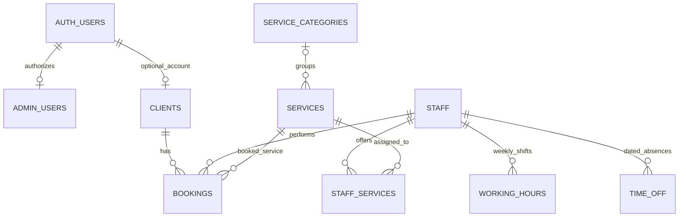

# Single-salon booking database

Each deployed website uses one salon database. There is no business directory or tenant membership model after migration 005. `business_id` is removed from every application table.

`salon_settings` has exactly one row for the salon name, contact details, timezone and booking rules. Its primary key is not referenced by the other tables. `admin_users` holds only the Auth user ID, username and role. Passwords remain in Supabase Auth.

| Table | Purpose and relevant links |
| --- | --- |
| salon_settings | One settings record, no outgoing application relationships |
| admin_users | Administrator access; user_id references Auth users |
| clients | Customer contact details; optional user_id references Auth users |
| bookings | References one client, staff member and service |
| staff | Staff name and active status |
| services | Price, duration and buffer; optional category_id |
| service_categories | Category name and display order |
| staff_services | Two-column join between staff and services |
| working_hours | Multiple weekly shifts for each staff member |
| time_off | Multiple dated breaks or holidays for each staff member |

The join table is necessary because staff and services have a many-to-many relationship. A JSON list under staff would lose ordinary foreign-key enforcement. Weekly shifts and dated absences remain separate because they have different rules and may each contain multiple records.

Booking contact details, price and time boundaries are snapshots. Changing a client's details or a service's current price must not rewrite past bookings. `request_id` prevents duplicate submissions. `reserved_until` includes the buffer and is used by the database overlap constraint.

## Release order

1. Deploy the compatible application through its feature branch and approved PR. While `salon_settings` is absent, the temporary compatibility adapter still scopes the original tables to the configured salon. The website no longer sends business IDs.
2. Review live SQL dependencies, grants and column definitions. Run `005_single_salon.sql` as the database owner. The transaction locks the affected tables, archives all original rows and schema metadata in the private `booking_archive_20261010` schema, retains the configured salon, renames its settings and admin tables, removes tenancy columns and rebuilds the relevant foreign keys and policies. Other demo records are preserved only in the private archive.
3. Confirm that no public `businesses`, `business_members` or `business_id` remain. Confirm one settings row, retained record counts, RLS, booking overlap checks and service qualification checks. Verify the live owner and customer flows.

The migration defaults to the North & Co. demo. For a different legacy database, set `booking.salon_slug` in the SQL session before running it. It fails if the salon or owner is missing, if unexpected external foreign keys exist, or if it has already been applied.

The archive is not exposed through the public Data API. Do not delete it during this release. After migration, roll the application back only to a version supporting the single-salon schema. Restoring the earlier database requires using the private archive and metadata, reconciling bookings created since migration, and retesting before a cutover.

## Verification

`node --test tests/booking-schema.test.mjs` runs PostgreSQL locally through PGlite. It checks record retention, archive access, foreign keys, single-row settings, staff/service eligibility, idempotency, booking overlaps, working hours, time off, historical prices and customer/admin access.

`node scripts/rehearse-booking-migration.mjs <private-snapshot.json>` rehearses the migration against current records using the hosted column, constraint, index, function and trigger definitions exported on 10 October 2026. It compares every retained value. Auth users and roles are local test doubles; hosted permissions still need verification after cutover. Keep snapshots outside Git.

The customer/admin API, category verification and production build are also checked before release. Hosted migration and live verification must be reported separately from local test results.
